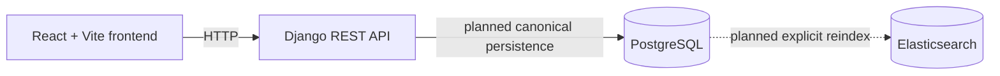

# Architecture

## Purpose and Day 1 scope

This repository is the platform foundation for a LinkedIn profile search application. Day 1
establishes the Django and React applications, the relational profile model foundation, Docker
Compose services, and unauthenticated health endpoints. It does not implement profile ingestion,
indexing, searching, or user authentication.

## Application architecture

The React and TypeScript frontend is served by Vite and is the client for a future Django REST API.
The Django backend currently exposes only health endpoints and owns the initial relational model
definitions. PostgreSQL is the planned canonical source of truth. Elasticsearch is a derived search
index that will be rebuilt explicitly from PostgreSQL; it is running in Compose but is not integrated
with Django in Day 1.



## Current service responsibilities

- `frontend` runs the React, TypeScript, and Vite application shell.
- `backend` runs Django and Django REST Framework, including the health endpoints and profile model
  foundation.
- `db` runs PostgreSQL 16, where application profile data will be canonical.
- `elasticsearch` runs Elasticsearch 8 as infrastructure for the future derived search index. No
  Django client, mappings, or indexing code exists yet.

## Data-model foundation

- A `Profile` represents a person and has a unique public identifier.
- A `Profile` has many `Skill` records through a many-to-many relationship. A `Skill` can belong to
  many profiles and has a unique name.
- A `Profile` has many `Experience` records. Each experience belongs to one profile and is deleted
  with its profile.
- A `Profile` has many `Education` records. Each education belongs to one profile and is deleted
  with its profile.

The model includes basic identity, contact-free profile, experience, education, and timestamp
fields. There is no import or search API yet.

## Health endpoint semantics

- `GET /health/live/` returns `200` with `{"status":"ok"}` and does not access PostgreSQL. It
  indicates that the Django process can serve requests.
- `GET /health/ready/` executes `SELECT 1` through the default database connection. A successful
  connectivity check returns `200` with `{"status":"ok","database":"ok"}`.
- A Django `DatabaseError` returns a stable `503` response with
  `{"status":"unavailable","database":"unavailable"}`. Exception details are not returned.
- Readiness is limited to PostgreSQL connectivity for Day 1. It does not check migration status or
  Elasticsearch availability.

## Docker Compose topology

Compose runs `db`, `elasticsearch`, `backend`, and `frontend`. The backend uses the Compose service
hostnames `db` and `elasticsearch`; the frontend calls the backend through the host-published port.
The backend waits for healthy database and Elasticsearch containers before starting, while the
frontend waits for the backend health check. PostgreSQL and Elasticsearch data use named volumes.

## Planned Day 2 interfaces

Day 2 is expected to add these explicit Django management commands:

```bash
python manage.py import_profiles --path /absolute/path/to/profiles.json
python manage.py rebuild_profile_index
```

These commands are documented interfaces only; they are not implemented or runnable in the Day 1
foundation. Import will establish PostgreSQL data, and reindexing will rebuild the derived
Elasticsearch representation explicitly.

## Intentionally deferred

JWT authentication, dataset parsing and import, Elasticsearch clients and mappings, index
rebuilding, the search API, protected API access, and the complete profile search UI are deferred to
later slices. Django signals will not be used for PostgreSQL-to-Elasticsearch indexing.
