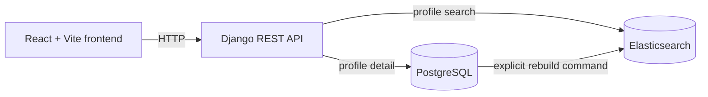

# Architecture

## Purpose and current scope

This repository is the platform foundation for a LinkedIn profile search application. It includes
an explicit, repeatable CSV importer, JWT authentication with public API documentation, an
explicitly rebuildable Elasticsearch profile index, an authenticated search API, an authenticated
PostgreSQL profile-detail API, and a React authentication foundation. The profile search UI is
deferred to Phase 3B.

## Application architecture

The React and TypeScript frontend is served by Vite and is the client for the Django REST API. The
Django backend exposes health, authentication, and API documentation endpoints and owns the
relational user and profile data. PostgreSQL is the canonical source of truth. Elasticsearch is a
derived search index rebuilt explicitly from PostgreSQL. Profile writes and imports do not contact
Elasticsearch.



## Current service responsibilities

- `frontend` runs the React, TypeScript, and Vite application shell, authentication routes, and the
  protected search placeholder.
- `backend` runs Django and Django REST Framework, including health, JWT authentication,
  OpenAPI/Swagger documentation, Elasticsearch profile search, and PostgreSQL profile detail.
- `db` runs PostgreSQL 16, where application profile data will be canonical.
- `elasticsearch` runs Elasticsearch 8.17 and stores the derived `linkedin_profiles_v1` index.
  Django integrates through one small gateway for index lifecycle, bulk operations, and search.

## Data-model foundation

- A `Profile` represents a person and has a unique public identifier. LinkedIn ID, username, and
  canonical profile URL are nullable dedicated identity aliases, each unique when present.
- `Profile.raw_payload` preserves the original source columns for diagnostics and future mapping
  work. Identity resolution never queries this JSON field.
- A `Profile` has many `Skill` records through a many-to-many relationship. A `Skill` can belong to
  many profiles and has a unique name.
- A `Profile` has many `Experience` records. Each experience belongs to one profile and is deleted
  with its profile.
- A `Profile` has many `Education` records. Each education belongs to one profile and is deleted
  with its profile.

The model includes basic identity, contact-free profile, experience, education, and timestamp
fields. Experience and education preserve zero-based source order with a unique position per
profile. Both import and index rebuild commands are explicit. Search reads Elasticsearch; profile
detail reads the canonical PostgreSQL models with bounded relation prefetching.

## Health endpoint semantics

- `GET /health/live/` returns `200` with `{"status":"ok"}` and does not access PostgreSQL. It
  indicates that the Django process can serve requests.
- `GET /health/ready/` executes `SELECT 1` through the default database connection. A successful
  connectivity check returns `200` with `{"status":"ok","database":"ok"}`.
- A Django `DatabaseError` returns a stable `503` response with
  `{"status":"unavailable","database":"unavailable"}`. Exception details are not returned.
- Readiness is limited to PostgreSQL connectivity. It does not check migration status or
  Elasticsearch availability.

## Authentication and API documentation

- `POST /api/v1/auth/register/` creates a user with Django's default user model and never issues a
  token.
- `POST /api/v1/auth/token/` and `POST /api/v1/auth/token/refresh/` are standard Simple JWT
  endpoints. Access tokens last 15 minutes and refresh tokens last 7 days. Refresh rotation and
  token blacklisting are disabled; tokens are not stored in the database.
- `GET /api/v1/auth/me/` requires a valid `Authorization: Bearer <access-token>` header and returns
  only the current user's id, username, and email.
- The default API permission is authenticated access. Health, registration, token, schema, and
  Swagger endpoints explicitly remain public.
- `GET /api/schema/` serves the OpenAPI schema and `GET /api/docs/` serves Swagger UI. CORS allows
  only the origins listed in `CORS_ALLOWED_ORIGINS`; credentials are disabled.

The frontend keeps the access token in memory and normally keeps the refresh token in `sessionStorage`;
an in-memory refresh fallback is used only when storage is unavailable. On startup, the authentication
provider performs one refresh when a refresh token exists and then loads `/api/v1/auth/me/`; protected
content remains hidden until this resolves. Protected API calls share one in-flight refresh after a
401, while abort and retry behavior remains scoped to each original caller. Session generations and
idempotent expiry cleanup prevent late responses or concurrent 401s from restoring or repeatedly
clearing a session. Logout is client-side because the backend has no logout endpoint: it removes local
tokens but does not revoke already-issued JWTs, which remain valid server-side until expiration.
Production deployments should prefer secure HttpOnly cookies and server-side revocation; both are
outside the current backend contract. See `docs/frontend-auth.md` for the complete frontend flow.

## Docker Compose topology

Compose runs `db`, `elasticsearch`, `backend`, and `frontend`. The backend uses the Compose service
hostnames `db` and `elasticsearch`; the frontend calls the backend through the host-published port.
The backend requires a healthy PostgreSQL container but has no startup dependency on Elasticsearch,
while the frontend waits for the backend health check. Explicit indexing commands and profile search
requests require Elasticsearch. PostgreSQL and Elasticsearch data use named volumes.

## Import interface

```bash
python manage.py import_profiles --path /data/profiles.txt
```

The importer requires the exact 77-column CSV header, skips malformed-width records without repair,
and reports logical/physical row ranges using reason codes. It parses and normalizes every accepted
row before consolidating duplicates through all canonical aliases. Only then does one transaction
persist one final plan per profile. Tri-state values distinguish valid values, explicit empties, and
invalid input. Complete valid nested lists synchronize source positions and remove stale rows;
partial lists preserve invalid/unmatched positions, while invalid top-level collections are kept
unchanged. Diff-aware writes preserve unchanged profile timestamps and retained child primary keys.
Database counters report actual creates, updates, unchanged rows, and deletes.

## Search-index boundary

`apps/search` owns the Elasticsearch mapping, deterministic document projection, client gateway,
and management commands. `create_profile_index` idempotently creates the empty versioned index.
`rebuild_profile_index` deletes and recreates it, iterates PostgreSQL profiles with prefetched
relations, bulk-indexes bounded batches using stable profile primary-key IDs, and refreshes once on
success. This simple replacement removes stale documents but makes the index temporarily unavailable.
Failures are translated to stable command errors; raw Elasticsearch responses and profile values are
not printed. See `docs/search-index.md` for the exact contract.

The HTTP search path keeps four small responsibilities separate. DRF validates and trims input; a
pure query builder creates the understandable Elasticsearch request; the existing gateway executes
that request; and a service translates only allowlisted source fields and normalized facet buckets
into the public API. One request produces both hits and all five facets. Connection, timeout,
transport, missing-index, and malformed-response failures become the stable `search_unavailable`
503 without a PostgreSQL fallback. Internally created Elasticsearch clients close on every path.

`GET /api/v1/profiles/{id}/` does not pass through this boundary. It selects the profile from
PostgreSQL and prefetches skills, experiences, and education in three deterministic queries. It
therefore remains operational during an Elasticsearch outage and excludes the raw import payload
and importer bookkeeping from serialization. Its scalar company, industry, and country values are
explicitly allowlisted from imported payload keys because dedicated relational columns do not yet
exist; arbitrary nested payload values and contact fields are never exposed.

No Django signals or application-startup hooks synchronize profile writes. This keeps PostgreSQL
writes independent from Elasticsearch and makes index state explicitly reproducible and observable.
Backend startup, migrations, imports, authentication, profile detail, and ordinary tests remain
available when Elasticsearch is stopped. The readiness endpoint therefore remains PostgreSQL-only.

## Intentionally deferred

The profile search form, results, facets, pagination, and detail UI are deferred to Phase 3B.
Zero-downtime alias rotation, incremental synchronization, autocomplete, fuzzy or semantic search,
and saved searches remain intentionally outside the assignment-sized scope.
