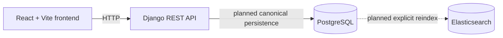

# Architecture

## Purpose and Day 2 scope

This repository is the platform foundation for a LinkedIn profile search application. Day 2 adds an
explicit, repeatable CSV importer and JWT authentication with public API documentation. The identity,
raw-payload, and source-order fields support future search. Indexing and searching are not implemented.

## Application architecture

The React and TypeScript frontend is served by Vite and is the client for the Django REST API. The
Django backend exposes health, authentication, and API documentation endpoints and owns the
relational user and profile data. PostgreSQL is the canonical source of truth. Elasticsearch is a
derived search index that will be rebuilt explicitly from PostgreSQL; it is running in Compose but
is not integrated with Django in this phase.



## Current service responsibilities

- `frontend` runs the React, TypeScript, and Vite application shell.
- `backend` runs Django and Django REST Framework, including health endpoints, JWT authentication,
  OpenAPI/Swagger documentation, and the profile model foundation.
- `db` runs PostgreSQL 16, where application profile data will be canonical.
- `elasticsearch` runs Elasticsearch 8 as infrastructure for the future derived search index. No
  Django client, mappings, or indexing code exists yet.

## Data-model foundation

- A `Profile` represents a person and has a unique public identifier. LinkedIn ID, username, and
  canonical profile URL are nullable dedicated identity aliases, each unique when present.
- `Profile.raw_payload` preserves the original source columns for diagnostics and future mapping
  work. Identity resolution never queries this JSON field.
- A `Profile` has many `Skill` records through a many-to-many relationship. A `Skill` can belong to
  many profiles and has a unique name.
- A `Profile` has many `Experience` records. Each experience belongs to one profile and is deleted
  with its profile.
- A `Profile` has many `Education` records. Each education belongs to one profile and is deleted
  with its profile.

The model includes basic identity, contact-free profile, experience, education, and timestamp
fields. Experience and education preserve zero-based source order with a unique position per
profile. The import command is explicit; there is no search API yet.

## Health endpoint semantics

- `GET /health/live/` returns `200` with `{"status":"ok"}` and does not access PostgreSQL. It
  indicates that the Django process can serve requests.
- `GET /health/ready/` executes `SELECT 1` through the default database connection. A successful
  connectivity check returns `200` with `{"status":"ok","database":"ok"}`.
- A Django `DatabaseError` returns a stable `503` response with
  `{"status":"unavailable","database":"unavailable"}`. Exception details are not returned.
- Readiness is limited to PostgreSQL connectivity. It does not check migration status or
  Elasticsearch availability.

## Authentication and API documentation

- `POST /api/v1/auth/register/` creates a user with Django's default user model and never issues a
  token.
- `POST /api/v1/auth/token/` and `POST /api/v1/auth/token/refresh/` are standard Simple JWT
  endpoints. Access tokens last 15 minutes and refresh tokens last 7 days. Refresh rotation and
  token blacklisting are disabled; tokens are not stored in the database.
- `GET /api/v1/auth/me/` requires a valid `Authorization: Bearer <access-token>` header and returns
  only the current user's id, username, and email.
- The default API permission is authenticated access. Health, registration, token, schema, and
  Swagger endpoints explicitly remain public.
- `GET /api/schema/` serves the OpenAPI schema and `GET /api/docs/` serves Swagger UI. CORS allows
  only the origins listed in `CORS_ALLOWED_ORIGINS`; credentials are disabled.

## Docker Compose topology

Compose runs `db`, `elasticsearch`, `backend`, and `frontend`. The backend uses the Compose service
hostnames `db` and `elasticsearch`; the frontend calls the backend through the host-published port.
The backend waits for healthy database and Elasticsearch containers before starting, while the
frontend waits for the backend health check. PostgreSQL and Elasticsearch data use named volumes.

## Import interface

```bash
python manage.py import_profiles --path /data/profiles.txt
```

The importer requires the exact 77-column CSV header, skips malformed-width records without repair,
and reports logical/physical row ranges using reason codes. It parses and normalizes every accepted
row before consolidating duplicates through all canonical aliases. Only then does one transaction
persist one final plan per profile. Tri-state values distinguish valid values, explicit empties, and
invalid input. Complete valid nested lists synchronize source positions and remove stale rows;
partial lists preserve invalid/unmatched positions, while invalid top-level collections are kept
unchanged. Diff-aware writes preserve unchanged profile timestamps and retained child primary keys.
Database counters report actual creates, updates, unchanged rows, and deletes.

## Intentionally deferred

Elasticsearch clients and mappings, index rebuilding, the search API, and the complete profile
search UI are deferred to later slices. Django signals will not be used for PostgreSQL-to-
Elasticsearch indexing.
